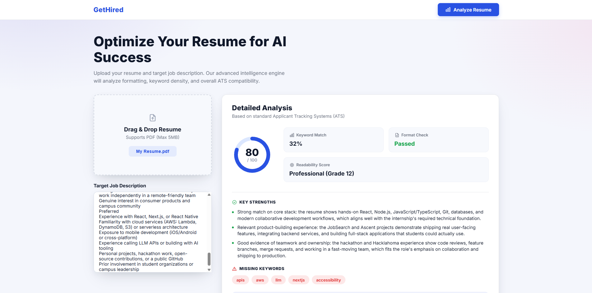
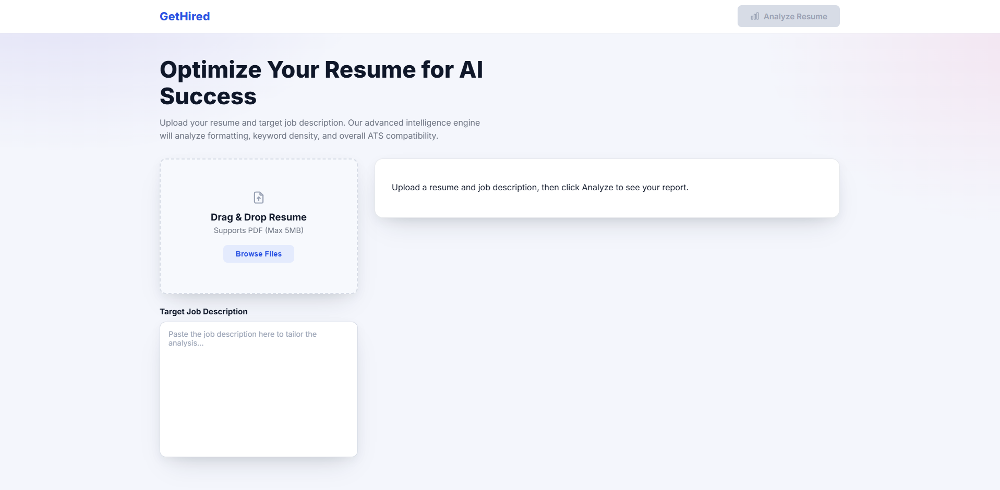
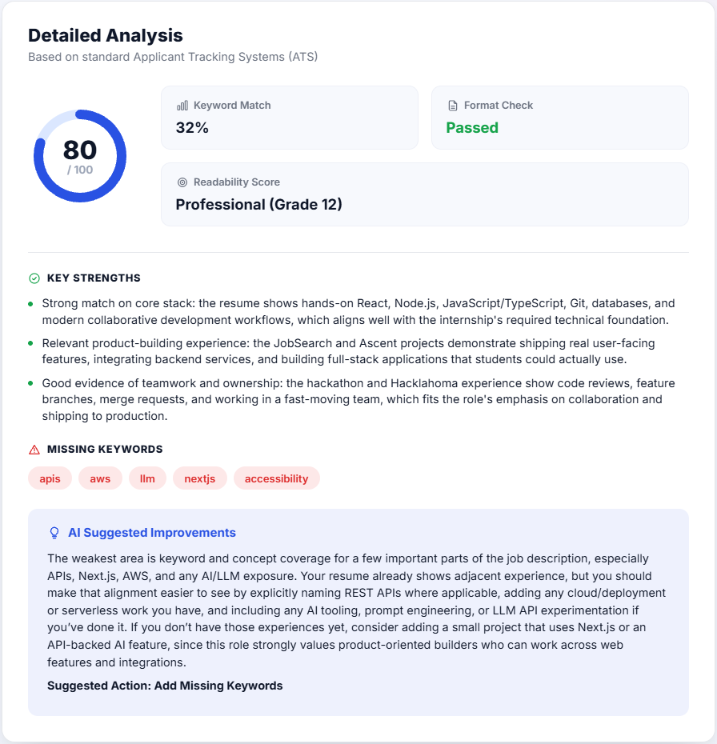

<a id="readme-top"></a>

[![Contributors][contributors-shield]][contributors-url]
[![Forks][forks-shield]][forks-url]
[![Stargazers][stars-shield]][stars-url]
[![Issues][issues-shield]][issues-url]
[![LinkedIn][linkedin-shield]][linkedin-url]

<br />
<div align="center">
  <h3 align="center">GetHired</h3>

  <p align="center">
    An AI-powered resume review tool that scores a resume against a target job description using a deliberate mix of rules, classical ML, and an LLM.
    <br />
    <a href="https://github.com/tylerrstage/get-hired-ai">View Repo</a>
    &middot;
    <a href="https://github.com/tylerrstage/get-hired-ai/issues/new?labels=bug">Report Bug</a>
    &middot;
    <a href="https://github.com/tylerrstage/get-hired-ai/issues/new?labels=enhancement">Request Feature</a>
  </p>
</div>

<details>
  <summary>Table of Contents</summary>
  <ol>
    <li>
      <a href="#about-the-project">About The Project</a>
      <ul>
        <li><a href="#built-with">Built With</a></li>
      </ul>
    </li>
    <li><a href="#how-it-works">How It Works</a></li>
    <li><a href="#design-philosophy-rules-vs-classical-ml-vs-llm">Design Philosophy: Rules vs. Classical ML vs. LLM</a></li>
    <li><a href="#working-with-claude-code">Working with Claude Code</a></li>
    <li>
      <a href="#getting-started">Getting Started</a>
      <ul>
        <li><a href="#prerequisites">Prerequisites</a></li>
        <li><a href="#installation">Installation</a></li>
      </ul>
    </li>
    <li><a href="#usage">Usage</a></li>
    <li><a href="#roadmap--known-limitations">Roadmap / Known Limitations</a></li>
    <li><a href="#license">License</a></li>
    <li><a href="#contact">Contact</a></li>
  </ol>
</details>

## About The Project



Upload a resume (PDF) and paste a target job description, and this tool returns a structured report: an overall fit score, a keyword match percentage, a format check, a readability grade, AI-generated strengths, missing keywords, and a specific suggested improvement.

The interesting part of this project isn't any single feature — it's that the analysis deliberately isn't one LLM call doing everything. Some parts are hand-built algorithms, some are classical machine learning, and some genuinely need an LLM's judgment. That mix, and why each piece is built the way it is, is covered in [Design Philosophy](#design-philosophy-rules-vs-classical-ml-vs-llm) below.

<p align="right">(<a href="#readme-top">back to top</a>)</p>

### Built With

* [![React][React.js]][React-url]
* [![Vite][Vite.js]][Vite-url]
* [![Python][Python.py]][Python-url]
* [![FastAPI][FastAPI.py]][FastAPI-url]
* [![scikit-learn][Scikit.py]][Scikit-url]
* [![OpenAI][OpenAI.badge]][OpenAI-url]

<p align="right">(<a href="#readme-top">back to top</a>)</p>

## How It Works

A single request to `POST /analyze` runs the resume and job description through a pipeline of independent steps, most of which were built from scratch rather than pulled from a library wholesale:

```
Resume PDF + Job Description
        │
        ▼
  pdf_parser.py       PDF → raw text (pdfplumber)
        │
        ▼
  tokenizer.py         lowercase, strip punctuation/Unicode symbols,
        │               remove stopwords, hash-map word-frequency counting
        │
        ├──▶ keyword_match.py   TF-IDF vectors (resume vs. job description)
        │                        + cosine similarity → Keyword Match %
        │                        + missing-keyword detection
        │
        ├──▶ readability.py     hand-rolled Flesch-Kincaid grade level
        │                        (syllable counting, sentence splitting)
        │
        ├──▶ format_check.py    regex rules: email, phone, required
        │                        section headers present
        │
        └──▶ ai_review.py       OpenAI call, grounded with all of the above,
                                  returns strengths / suggestion / fit score
                                  as schema-guaranteed structured JSON
        │
        ▼
  scoring.py            weighted combination → final score out of 100
        │
        ▼
  AnalysisResponse (JSON) → rendered in the React UI
```

<p align="right">(<a href="#readme-top">back to top</a>)</p>

## Design Philosophy: Rules vs. Classical ML vs. LLM

Three different techniques are doing three different jobs in this project, on purpose:

**Rules, for objective, well-defined criteria.** `format_check.py` checks things like "is there an email address" and "are the standard section headers present" using plain regex. There's no ambiguity in these questions — reaching for a statistical model here would be overkill. This is the right tool exactly when the criteria are enumerable and don't require judgment.

**Classical ML, for measurable-but-fuzzy patterns.** `keyword_match.py` uses TF-IDF (term frequency × inverse document frequency) and cosine similarity from scikit-learn to measure vocabulary overlap between the resume and job description. This surfaced a real, worth-knowing limitation during development: raw cosine similarity between a resume and a job posting rarely gets very high even for a strong match, because the two documents are written in completely different registers (a resume describes accomplishments, a job posting describes requirements) — genuine overlap can sit in the single digits to low twenties percent. That's not a bug, it's a property of comparing short, differently-phrased documents with a bag-of-words technique. It's a real, honest signal, just one that needs to be interpreted on its own scale rather than assumed to run 0–100 the way a percentage suggests.

**An LLM, for judgment that neither rules nor statistics can provide.** `ai_review.py` sends the resume, the job description, and every metric already computed above (explicitly labeled as "already computed, do not recalculate") to an LLM via OpenAI's Structured Outputs, which guarantees the response matches a fixed JSON schema instead of hoping the model formats its reply correctly. This is where the tool does the parts a human reviewer actually adds value on: reading "5 years of React experience" and understanding that's a meaningful signal even if the job description never uses the word "React." One calibration issue came up in testing worth mentioning: an unanchored 0–100 "fit score" produced inconsistent, often overly harsh scores for resumes with real but partial relevance. Adding explicit rubric anchors to the prompt (what should score in the 0-20 / 21-40 / 41-60 / etc. ranges) made scores meaningfully more consistent — a small, concrete example of why prompt design is its own skill, not an afterthought.

The overall score is a deliberately weighted combination of these signals rather than something any single technique produces on its own — see `scoring.py` for the current weights and reasoning.

<p align="right">(<a href="#readme-top">back to top</a>)</p>

## Working with Claude Code

This project was built end-to-end with [Claude Code](https://claude.com/claude-code) as a learning tool, not an autopilot. The working pattern for most of the backend was: Claude explained the concept (TF-IDF math, what a Python decorator actually does, why cosine similarity is the right comparison for TF-IDF vectors, HTTP/CORS/multipart-form mechanics) before any code was written, and I typed and ran the code myself so I could actually debug it when it broke — which happened, and was often the most useful part. For smaller, well-specified mechanical changes later in the project (wiring already-agreed-on data through component props) and revisions to the UI, I had Claude make the edits directly, a judgment call about when hands-on-keyboard time is actually teaching me something versus just typing.

<p align="right">(<a href="#readme-top">back to top</a>)</p>

## Getting Started

### Prerequisites

* Node.js and npm
  ```sh
  npm install npm@latest -g
  ```
* Python 3.x with `venv`

### Installation

1. Get an OpenAI API key at [platform.openai.com](https://platform.openai.com/)
2. Clone the repo
   ```sh
   git clone https://github.com/tylerrstage/get-hired-ai.git
   ```
3. Set up the backend
   ```sh
   cd backend
   python -m venv venv
   .\venv\Scripts\Activate.ps1
   pip install -r requirements.txt
   ```
4. Create `backend/.env`
   ```
   OPENAI_API_KEY=your-api-key-here
   ```
5. Install frontend packages (from the project root)
   ```sh
   npm install
   ```

<p align="right">(<a href="#readme-top">back to top</a>)</p>

## Usage

Run the backend and frontend in two separate terminals — both need to be running simultaneously, since the frontend expects the API at `http://127.0.0.1:8000`.

```sh
# terminal 1 — backend/, venv activated
uvicorn main:app --reload

# terminal 2 — project root
npm run dev
```

Open the Vite dev URL, upload a resume PDF, paste a target job description, and click **Analyze Resume**. API docs (Swagger UI) are available at `http://127.0.0.1:8000/docs`.

Before an analysis has run, the report panel shows an empty state:



After clicking Analyze, it fills in with the real report — score, keyword match, format check, readability, strengths, missing keywords, and the AI-generated suggestion:



<p align="right">(<a href="#readme-top">back to top</a>)</p>

## Roadmap / Known Limitations

- [ ] Swap TF-IDF keyword matching for semantic embeddings, so related-but-not-identical terms (e.g. "React" vs. "frontend framework experience") are recognized as related
- [ ] Dictionary-based syllable counting for the readability score, instead of the current vowel-group heuristic
- [ ] OCR fallback for scanned/image-based PDFs, which currently extract no text
- [ ] Deploy publicly (currently local-only)

See the [open issues](https://github.com/tylerrstage/get-hired-ai/issues) for a full list.

<p align="right">(<a href="#readme-top">back to top</a>)</p>

<!-- MARKDOWN LINKS & IMAGES -->
[contributors-shield]: https://img.shields.io/github/contributors/tylerrstage/get-hired-ai.svg?style=for-the-badge
[contributors-url]: https://github.com/tylerrstage/get-hired-ai/graphs/contributors
[forks-shield]: https://img.shields.io/github/forks/tylerrstage/get-hired-ai.svg?style=for-the-badge
[forks-url]: https://github.com/tylerrstage/get-hired-ai/network/members
[stars-shield]: https://img.shields.io/github/stars/tylerrstage/get-hired-ai.svg?style=for-the-badge
[stars-url]: https://github.com/tylerrstage/get-hired-ai/stargazers
[issues-shield]: https://img.shields.io/github/issues/tylerrstage/get-hired-ai.svg?style=for-the-badge
[issues-url]: https://github.com/tylerrstage/get-hired-ai/issues
[linkedin-shield]: https://img.shields.io/badge/-LinkedIn-black.svg?style=for-the-badge&logo=linkedin&colorB=555
[linkedin-url]: https://linkedin.com/in/tyler-stageberg
[React.js]: https://img.shields.io/badge/React-20232A?style=for-the-badge&logo=react&logoColor=61DAFB
[React-url]: https://reactjs.org/
[Vite.js]: https://img.shields.io/badge/Vite-646CFF?style=for-the-badge&logo=vite&logoColor=FFD62E
[Vite-url]: https://vitejs.dev/
[Python.py]: https://img.shields.io/badge/Python-3776AB?style=for-the-badge&logo=python&logoColor=white
[Python-url]: https://www.python.org/
[FastAPI.py]: https://img.shields.io/badge/FastAPI-005571?style=for-the-badge&logo=fastapi
[FastAPI-url]: https://fastapi.tiangolo.com/
[Scikit.py]: https://img.shields.io/badge/scikit--learn-F7931E?style=for-the-badge&logo=scikit-learn&logoColor=white
[Scikit-url]: https://scikit-learn.org/
[OpenAI.badge]: https://img.shields.io/badge/OpenAI-412991?style=for-the-badge&logo=openai&logoColor=white
[OpenAI-url]: https://platform.openai.com/
